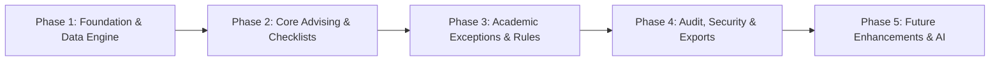

# Product Requirements Document (PRD)

## Student Academic Advising Information System (SAAIS)

---

## 1. Executive Summary & Vision

### 1.1 Overview

The **Student Academic Advising Information System (SAAIS)** is a secure, responsive, web-based platform engineered to modernize and centralize academic advising across higher education institutions. It replaces manual, error-prone, paper- or spreadsheet-based advising workflows with an auditable, contract-first system of record.

SAAIS manages the entire academic advising lifecycle:

- **Curriculum Checklists & Degree Auditing**: Dynamic tracking of completed, ongoing, and remaining degree requirements across curriculum versions.
- **Enrollment Attempts & Grade History**: Unit-weighted General Weighted Average (GWA) calculation, discrete grading scales ($1.00$ to $5.00$), and course retake accounting.
- **Adviser-Student Assignment**: Longitudinal tracking of advising relationships with database-enforced zero-gap continuity.
- **Academic Exception Workflows**: Prerequisite soft checks with override auditing, Incomplete (INC) compliance deadlines with time-based GWA recomputation, elective mappings, and transfer course equivalency determinations.
- **Documentation & Auditability**: Staff-only advising notes, attempt remarks, and an immutable audit log.

### 1.2 Target User Roles & Permissions

| Role                     | Key Capabilities & Boundaries                                                                                                                                                                                                                                                                                                                                                                                                  |
| :----------------------- | :----------------------------------------------------------------------------------------------------------------------------------------------------------------------------------------------------------------------------------------------------------------------------------------------------------------------------------------------------------------------------------------------------------------------------- |
| **Student**              | <ul><li>View assigned curriculum checklist and completion progress.</li><li>View term-by-term grades, units earned, term GWA, and cumulative GWA.</li><li>View historical enrollment attempts and assigned academic adviser.</li><li>_Cannot view staff-only notes, attempt remarks, or audit logs._</li></ul>                                                                                                                 |
| **Academic Adviser**     | <ul><li>Manage assigned advisees and view historical advisees.</li><li>Record new enrollment attempts with prerequisite verification and override prompt.</li><li>Execute elective course mappings and transfer/discontinued-course equivalency decisions.</li><li>Add dated, append-only advising notes and per-attempt remarks (staff-only).</li><li>Initiate zero-gap adviser reassignments.</li></ul>                      |
| **System Administrator** | <ul><li>Provision and manage user accounts and assign roles (no public self-registration).</li><li>Manage degree programs, curriculum versions, and delinquency thresholds.</li><li>Maintain the master course catalog, prerequisite linkages, and repeatable rules.</li><li>Configure school terms, course offerings (including `by_request` flags), and term locks.</li><li>Access the immutable system audit log.</li></ul> |

---

## 2. Phased Implementation Roadmap

To deliver value quickly while managing system complexity, SAAIS is structured into **5 distinct phases**:



### Phase 1: Core Foundation & Master Data Engine (MVP Baseline)

- **Goal**: Establish the contract-first architecture, database schema, authentication with server-side pre-registration whitelist, and administrator catalog management.
- **Key Deliverables**:
  1. Hand-authored OpenAPI 3.1 contract (`contract/openapi.yaml`) with Redocly linting and `openapi-typescript` client generation.
  2. PostgreSQL schema migrations with Row Level Security (RLS) policies for `Profile`, `Program`, `CurriculumVersion`, `CurriculumTerm`, `Course`, `Prerequisite`, `SchoolTerm`, and `CourseOffering`.
  3. Supabase Auth integration with an Auth Hook enforcing that sign-ins (Email or Google OAuth) strictly match pre-registered administrator-created profiles.
  4. Admin Portal: CRUD for Programs, Curricula, Course Catalog, and School Terms / Offerings.

### Phase 2: Core Advising Workflows & Student Portal

- **Goal**: Enable active student-adviser relationships, enrollment recording, checklist generation, and GWA computation.
- **Key Deliverables**:
  1. Adviser-Student assignment with database-enforced zero-gap continuity (`AdviserAssignment` table + `reassignAdviser` Edge Function).
  2. Enrollment attempt recording (`Attempt` table + `recordEnrollmentAttempt` Edge Function) with soft prerequisite warnings and Continue/Cancel override auditing.
  3. Student Portal: Dashboard (Adviser, GWA, Delinquency status), interactive Curriculum Checklist view, and Term Grades history.
  4. Adviser Portal: Advisee roster search/filtering and comprehensive student 360-degree academic view.

### Phase 3: Academic Exceptions, INC Lapses & Documentation

- **Goal**: Support real-world university exceptions, transfer equivalencies, elective mappings, and automated scheduled rules.
- **Key Deliverables**:
  1. Incomplete (`INC`) deadline tracking (default 1-year compliance period).
  2. Scheduled daily `recomputeLapsedIncGwa` Edge Function (triggered via `pg_cron`) evaluating lapsed INCs as $5.00$ for GWA and delinquency flag calculation.
  3. Elective course mapping (`ElectiveMapping`) allowing advisers to map enrolled courses to elective curriculum slots.
  4. Course equivalency decisions (`EquivalencyDecision`) for transfer students and discontinued required courses.
  5. Staff-only advising notes (`AdvisingNote`) and attempt remarks (`AttemptRemark`).

### Phase 4: Audit Trail, Reporting, Accessibility & Compliance

- **Goal**: Production readiness, regulatory compliance, data reporting, and rigorous verification.
- **Key Deliverables**:
  1. Immutable `AuditLogEntry` repository with dedicated Admin Audit Viewer.
  2. Printable / downloadable PDF Advising Checklist and Official Grade Summary export.
  3. Full WCAG 2.1 AA accessibility audit (semantic markup, screen-reader status badges, keyboard navigation).
  4. Data Privacy Act of 2012 (RA 10173) compliance audit and data retention verification.
  5. Complete Playwright End-to-End (E2E) test suite running in GitHub Actions CI.

### Phase 5: Future Enhancements & Value-Adds

- **Goal**: Next-generation visual and predictive features.
- **Key Deliverables**:
  1. Interactive Prerequisite Visual DAG (Directed Acyclic Graph) flowchart.
  2. "What-If" Curriculum Shift & Degree Audit Simulator.
  3. Graduation Clearance & Deficiency Checker.
  4. AI-Powered Advising Assistant (RAG via Model Context Protocol / MCP).

---

## 3. Detailed Functional Requirements & Business Logic

### 3.1 Authentication & User Provisioning

1. **Admin-Only Provisioning**: Public self-registration is strictly disabled. Admins create user profiles specifying role (`student`, `adviser`, `admin`) and institutional email.
2. **Server-Side SSO Whitelisting**: Google OAuth sign-in is validated server-side via a Supabase Auth Hook (`before user created`). If the incoming Google email does not match a pre-registered `Profile.email`, authentication is immediately rejected.
3. **Session Management**: Client session is managed via `SessionContext` subscribing to `supabase.auth.onAuthStateChange`, populating `{ session, profile, role }` across route guards.

### 3.2 Academic Structure & Course Catalog

1. **Programs & Versioned Curricula**: A `Program` has one or more `CurriculumVersion` records with designated effective dates and distinct `delinquency_threshold` (failed units limit).
2. **Positional Terms vs. Calendar School Terms**:
   - `CurriculumTerm`: Positional slot (e.g., Year 1, Term 1) within a curriculum version.
   - `SchoolTerm`: Actual academic calendar term (e.g., Academic Year 2025–2026, 1st Semester). Includes `is_locked` and `override_flag` states.
3. **Course Attributes & Repeatable Types**:
   - Courses define lecture hours, lab hours, units, and status (`active` or `discontinued`).
   - `repeatable_type`:
     - `none` / `grade_replacement`: Only the **most recent Passed attempt** counts toward earned units and cumulative GWA. A later failure never reverts an already-passed course.
     - `additional_credit`: Every passed attempt stacks credit and counts independently toward earned units and GWA (e.g., special topics, practicum).

### 3.3 Enrollment Attempts & Prerequisite Engine

1. **Attempt Binding**: Each attempt references a specific `CourseOffering` (natural key: `student_id` + `course_offering_id`) and optionally a `CurriculumTermCourse` slot if it directly fulfills a curriculum requirement.
2. **Prerequisite Types**:
   - `strict`: Checked during enrollment.
   - `co_requisite`: Concurrent enrollment recommendation.
   - `recommended`: Advisory note.
3. **Soft Prerequisite Warning & Audit**:
   - When an adviser attempts to enroll a student missing a `strict` prerequisite, the system displays a soft-warning dialog: **Continue (Override)** or **Cancel**.
   - Selecting **Continue** records the attempt with `prerequisite_override = true` and creates an immutable `AuditLogEntry`.

### 3.4 Grading System, INC Resolution & GWA Computation

1. **Grading Scale**: Standard Philippine university scale from $1.00$ (highest) to $5.00$ (failed), evaluated in discrete $0.25$ steps. Passing grade is $\le 3.00$.
2. **Attempt Statuses**: `passed`, `failed`, `currently_enrolled`, `inc`, `dr` (dropped), `na` (no attendance).
3. **Incomplete (`INC`) Handling & Lapsed Recalculation**:
   - When assigned `inc`, a compliance deadline is set (`inc_deadline`, default 1 year from term incurred).
   - Resolved INCs receive an `INCResolution` with a completion grade.
   - Unresolved INCs past `inc_deadline` **permanently retain status `inc`** (never mutated to `failed`). However, for GWA and delinquency calculation purposes, lapsed INCs are dynamically treated as a grade of $5.00$ and counted as failed units.
   - `recomputeLapsedIncGwa` runs daily via `pg_cron` to refresh cached GWA and delinquency flags for newly lapsed attempts.
4. **General Weighted Average (GWA) Formula**:
   $$\text{GWA} = \frac{\sum (\text{Final Grade}_i \times \text{Units}_i)}{\sum \text{Units}_i}$$
   _(Computed across all eligible counting attempts per repeatable rules and lapsed INC rules)._

### 3.5 Adviser Assignment & Zero-Gap Continuity

1. **Single Active Adviser Invariant**: Every student must have exactly one active adviser at all times.
2. **Zero-Gap Enforcement**: When reassigning an adviser, the incoming assignment's `start_date` must equal the outgoing assignment's `end_date`. This is executed within an atomic database transaction via the `reassignAdviser` Edge Function and backstopped by PostgreSQL exclusion/trigger constraints.

### 3.6 Academic Exceptions: Elective Mappings & Equivalencies

1. **Elective Course Mapping (`ElectiveMapping`)**:
   - An adviser can map any enrolled course attempt to an open elective slot (`is_elective_slot = true`), even if course codes differ.
   - The checklist displays actual units earned while validating against nominal slot units.
2. **Curriculum Transfer Equivalency (`EquivalencyDecision`)**:
   - Evaluated strictly one-to-one when a student shifts curricula or transfers.
   - A passed attempt from the old curriculum satisfies a destination slot in the new curriculum without re-triggering destination GWA recomputations.
   - Can also map alternative active courses to required discontinued courses (`discontinued_course_equivalency`).

### 3.7 Staff-Only Advising Notes & Attempt Remarks

1. **Advising Notes (`AdvisingNote`)**: Dated, append-only, student-level notes recorded by advisers or admins.
2. **Attempt Remarks (`AttemptRemark`)**: Scoped to specific attempts or empty checklist slots.
3. **Privacy Barrier**: Notes and remarks are strictly staff-only (advisers and admins) and are inaccessible to students via RLS.

---

## 4. Technical Architecture & Contract-First Design

### 4.1 System Topology

```text
┌────────────────────────────────────────────────────────┐
│                   React 19 SPA (Vite)                  │
│       Tailwind CSS + shadcn/ui + TanStack Query        │
│       Typed API Client generated from OpenAPI 3.1      │
└─────────────────────────┬──────────────────────────────┘
                          │ HTTPS / JWT Bearer Auth
                          ▼
┌────────────────────────────────────────────────────────┐
│                 Supabase Backend Layer                 │
│                                                        │
│  ┌────────────────────────┐  ┌──────────────────────┐  │
│  │  PostgREST Direct API  │  │    Edge Functions    │  │
│  │  (Reads & simple CRUD) │  │ (Atomic Invariants)  │  │
│  │   Protected by RLS     │  │  (Deno + TypeScript) │  │
│  └───────────┬────────────┘  └───────────┬──────────┘  │
│              │                           │             │
│              ▼                           ▼             │
│  ┌──────────────────────────────────────────────────┐  │
│  │         PostgreSQL Database (Docker / Cloud)     │  │
│  │  - Row Level Security (RLS)                      │  │
│  │  - Zero-Gap Adviser Triggers & DB Constraints    │  │
│  │  - pg_cron (Daily Lapsed INC GWA recompute)      │  │
│  │  - Immutable Audit Trail Table                   │  │
│  └──────────────────────────────────────────────────┘  │
└────────────────────────────────────────────────────────┘
```

### 4.2 Contract-First Boundary

- **Single Source of Truth**: `contract/openapi.yaml` (OpenAPI 3.1).
- **Generation & Validation Pipeline**:
  - Linting: `@redocly/cli` (`npm run contract:lint`).
  - Type Generation: `openapi-typescript` generates `contract/generated/schema.d.ts` (`npm run contract:gen`).
  - Client: `openapi-fetch` wraps types with centralized authentication and error handling.
  - Drift Detection: CI automatically diffs `contract/openapi.yaml` against Supabase's live PostgREST schema to prevent unannounced breaking changes.

---

## 5. Ecosystem Research: Open-Source Work, APIs, MCPs & npm Libraries

To accelerate development and adhere to industry standards, the following verified resources have been researched and mapped to SAAIS requirements:

### 5.1 Open-Source Projects & References (GitHub)

1. **[FlightPath Academics (flightpathacademics/flightpath)](https://github.com/flightpathacademics/flightpath)**
   - **Domain**: Enterprise-grade open-source academic advising and degree audit system.
   - **Relevance to SAAIS**: Reference architecture for curriculum year tracking, elective substitutions, prerequisite validation rules, and degree audit checklists.
2. **[Technion Sogrim (sogrim/technion-sogrim)](https://github.com/sogrim/technion-sogrim)**
   - **Domain**: Open-source degree audit tool and graduation tracker.
   - **Relevance to SAAIS**: Algorithms for catalog requirement matching, slot fulfillment categorization, and student progress metrics.
3. **[NuAnalytics (NeuCurricularAnalytics/NuAnalytics)](https://github.com/NeuCurricularAnalytics/NuAnalytics)**
   - **Domain**: Curricular analytics and prerequisite network complexity analyzer.
   - **Relevance to SAAIS**: Graph structures for modeling prerequisite dependency chains and blocking factors in curricula.
4. **[Degree Audit Plus (Longhorn-Developers/Degree-Audit-Plus)](https://github.com/Longhorn-Developers/Degree-Audit-Plus)**
   - **Domain**: Interactive degree audit dashboard.
   - **Relevance to SAAIS**: UI/UX patterns for visualizing completed vs. remaining requirements and collapsible term checklists.
5. **[AI Academic Advisor (mostafaamer1234/AI_ACADEMIC_ADVISOR)](https://github.com/mostafaamer1234/AI_ACADEMIC_ADVISOR)**
   - **Domain**: LLM and RAG-based academic advisor for course prerequisites and student guidance.
   - **Relevance to SAAIS (Phase 5)**: Reference implementation for contextual querying over curriculum rules using AI assistants.

### 5.2 Model Context Protocol (MCP) Servers

1. **[Official Supabase MCP Server (`supabase/mcp`)](https://github.com/supabase/mcp)**
   - **Use Case**: Allows AI coding assistants (e.g. Antigravity) to inspect Postgres schemas, run and verify SQL migrations, generate TypeScript types, and execute database branch tests safely during development.
2. **[PostgREST MCP Server (`@supabase/mcp-server-postgrest`)](https://www.npmjs.com/package/@supabase/mcp-server-postgrest)**
   - **Use Case**: Enables programmatic exploration of REST endpoints and query translation during contract and test authoring.
3. **[OpenAPI MCP Bridge (`FastMCP` / `ivo-toby/openapi-mcp-server`)](https://github.com/ivo-toby/openapi-mcp-server)**
   - **Use Case**: Bridges `contract/openapi.yaml` to MCP tools, allowing automated contract verification and AI-assisted endpoint testing.

### 5.3 Verified npm Libraries & Tooling

| Library                   | Package Name                                      | Purpose in SAAIS                                                                                                          |
| :------------------------ | :------------------------------------------------ | :------------------------------------------------------------------------------------------------------------------------ |
| **Data Tables**           | `@tanstack/react-table`                           | High-performance sortable, filterable, and dense tables for student attempt histories, advisee rosters, and audit logs.   |
| **Graph / Flowcharts**    | `@xyflow/react` + `@dagrejs/dagre`                | Interactive directed acyclic graph (DAG) rendering for prerequisite visualizer and curriculum dependency trees (Phase 5). |
| **API Contract & Client** | `openapi-typescript` + `openapi-fetch`            | Strongly-typed client generation directly from `contract/openapi.yaml`. Zero manual type writing.                         |
| **API Documentation**     | `@redocly/cli` + `redoc`                          | Interactive in-app `/docs` route and static CI documentation bundle for the OpenAPI contract.                             |
| **API Mocking**           | `msw` + `@stoplight/prism-cli`                    | Standalone mock server and client mocking enabling frontend team to build screens prior to backend completion.            |
| **Form Management**       | `react-hook-form` + `@hookform/resolvers` + `zod` | Client-side validation mirroring OpenAPI request schemas.                                                                 |
| **UI Components**         | `lucide-react` + `cmdk`                           | Accessible iconography and command-palette searching for courses and advisees.                                            |
| **PDF Generation**        | `@react-pdf/renderer`                             | Client/server rendering of official, printable Advising Checklists and Transcript Summaries.                              |
| **Spreadsheet Export**    | `exceljs`                                         | High-fidelity export of advisee lists, grade sheets, and audit trails for administrators.                                 |

---

## 6. Recommended Future Features (Unwritten Value-Adds)

Based on industry advising benchmarks and modern academic workflows, the following features are recommended for subsequent development phases:

### 6.1 Interactive Prerequisite DAG Tree

- **Description**: A visual flowchart rendered with `@xyflow/react` showing the student's curriculum as a directed graph.
- **Benefit**: Color-codes completed (green), enrolled (blue), available (yellow), and blocked (red) courses, giving students and advisers an intuitive view of critical paths.

### 6.2 "What-If" Curriculum Shift & Degree Audit Simulator

- **Description**: Allows an adviser or student to simulate shifting to a different program or newer curriculum version.
- **Benefit**: Computes which passed courses map over, which courses would be lost, the new projected GWA, and remaining terms to graduate before executing a formal transfer.

### 6.3 Graduation Clearance & Deficiency Audit Engine

- **Description**: An automated audit tool for senior students checking whether all required units, residency requirements, elective quotas, and minimum GWAs are satisfied.
- **Benefit**: Generates a one-click deficiency report for departmental graduation committees.

### 6.4 Secure PDF Advising Clearance Slips with QR Verification

- **Description**: Generates a signed PDF clearance slip after each term's advising session containing a cryptographic hash / QR code.
- **Benefit**: Allows the university registrar to instantly verify that an adviser cleared a student's enrollment attempt.

### 6.5 Automated Early-Warning & INC Lapse Notifications

- **Description**: Scheduled alerts (in-app and email) sent 60 days and 30 days prior to an `INC` lapse deadline, or when a student's midterm grades place them at risk of delinquency.

---

## 7. Non-Functional, Security & Compliance Requirements

1. **Philippine Data Privacy Act of 2012 (RA 10173)**:
   - Student academic data, grades, and advising notes constitute sensitive personal information.
   - Access is strictly segregated by role via database RLS. Advising notes are permanently blocked from student retrieval.
2. **Zero Data Loss & Immutable Auditability**:
   - All overrides, equivalency decisions, elective mappings, and grade completions are recorded in `AuditLogEntry`. The table is protected by database rules preventing `UPDATE` or `DELETE`.
3. **Accessibility (WCAG 2.1 Level AA)**:
   - Status badges use distinct text labels, icons, and high-contrast color tokens.
   - Full keyboard navigation for all modals, comboboxes, and data tables.
4. **Performance & Scalability**:
   - Designed for multi-thousand student cohorts.
   - Cached GWA queries with automatic invalidation triggers on grade modification and daily cron evaluation for lapsed INCs.
5. **Continuous Integration & Quality Gates**:
   - Every Pull Request must pass: `contract:lint`, `contract:check`, `lint`, `typecheck`, `test` (Vitest), and `test:e2e` (Playwright against seeded Supabase instance).

---

## 8. Summary Checklist of Contract Endpoints & Core Tables

### Key Contract Endpoints

- `POST /functions/v1/enrollment-attempts` (`recordEnrollmentAttempt`): Soft-check prerequisite evaluation with override auditing.
- `POST /functions/v1/adviser-reassignment` (`reassignAdviser`): Atomic zero-gap adviser transition.
- `POST /functions/v1/equivalency-decisions` (`applyEquivalencyDecision`): Slot remapping for transfers and discontinued courses.
- `POST /functions/v1/recompute-lapsed-inc` (`recomputeLapsedIncGwa`): Service-role scheduled GWA/delinquency recalculation.
- `GET /rest/v1/curriculum_checklist`: Student checklist resolution view across direct attempts, equivalencies, and elective mappings.

### Core Database Entities

`Profile`, `AdviserAssignment`, `Program`, `CurriculumVersion`, `CurriculumTerm`, `Course`, `Prerequisite`, `CurriculumTermCourse`, `StudentCurriculumAssignment`, `ElectiveMapping`, `EquivalencyDecision`, `SchoolTerm`, `CourseOffering`, `Attempt`, `INCResolution`, `AdvisingNote`, `AttemptRemark`, `AuditLogEntry`.
